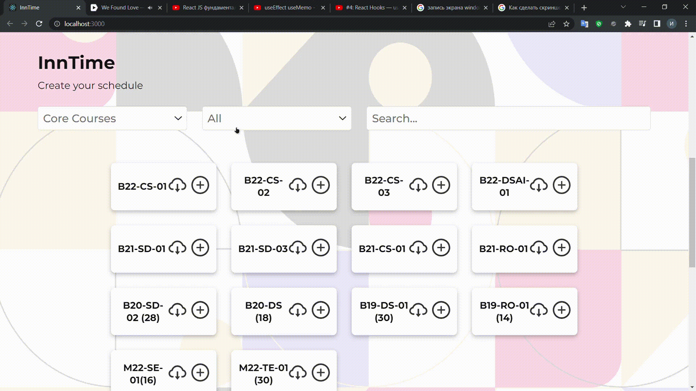

# InnTime

Timetable website for Innopolis University

## Current state
Wait for gifs
### Add feature

### Sort feature

## Links
### [layout in figma](https://www.figma.com/file/AzFwk8iwlLVP2j3rxVydNh/InnTime?type=design&node-id=0%3A1&t=n4lCEVnVnHJ4s9W3-1)

## Available Scripts

In the project directory, you can run:

### `npm start`

Runs the app in the development mode.\
Open [http://localhost:3000](http://localhost:3000) to view it in your browser.

The page will reload when you make changes.\
You may also see any lint errors in the console.
